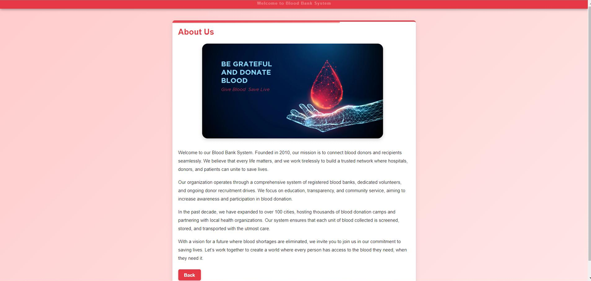
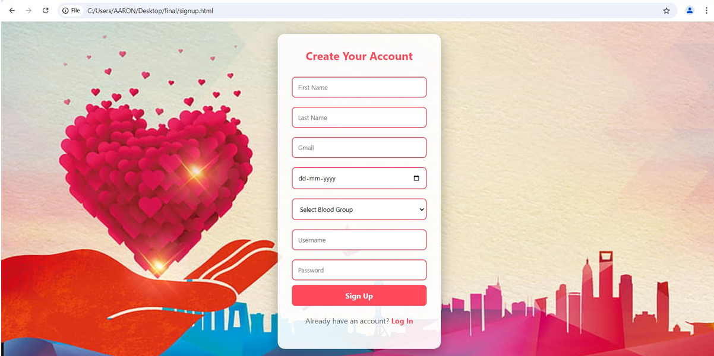
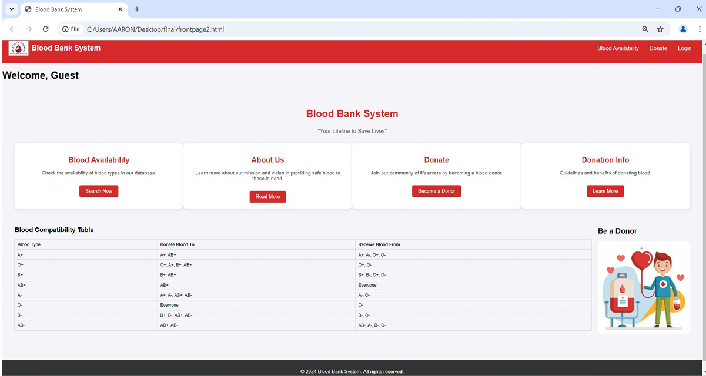
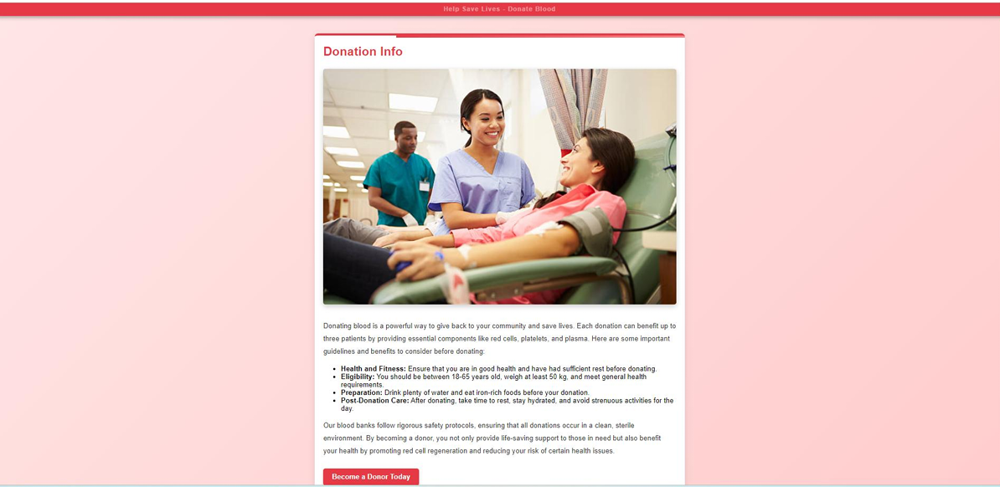
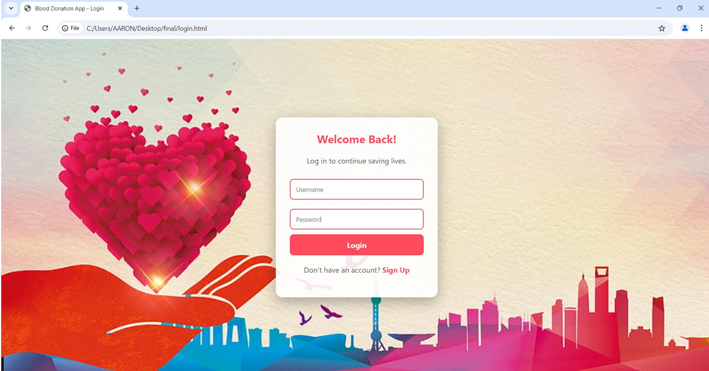
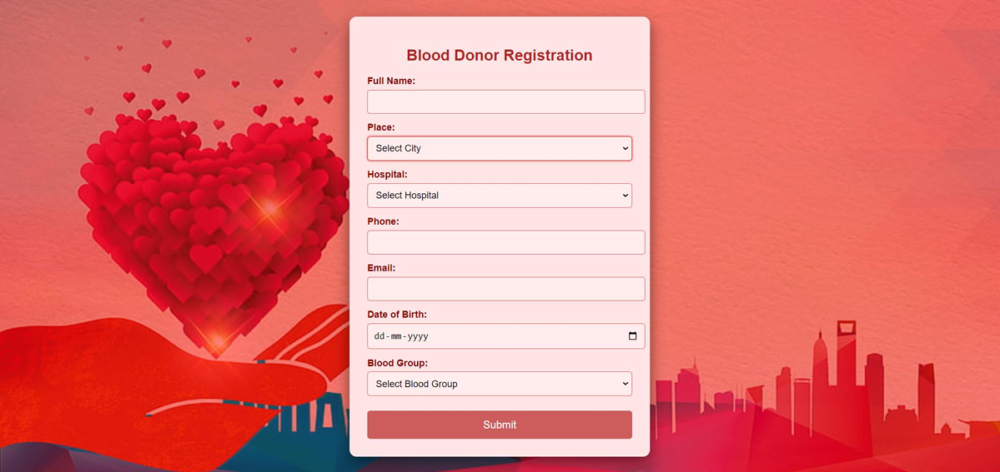
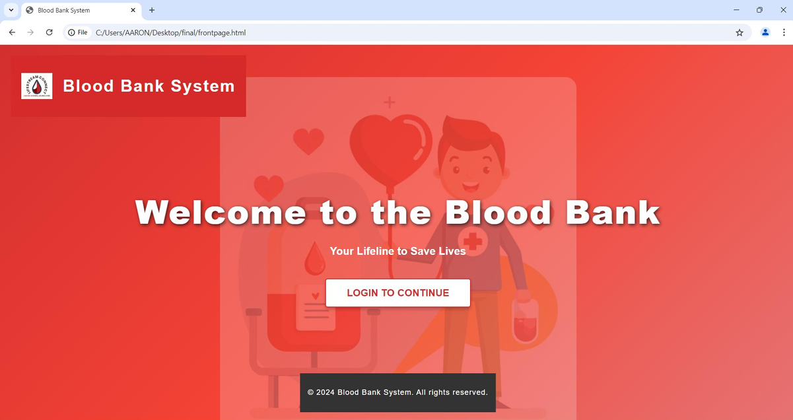
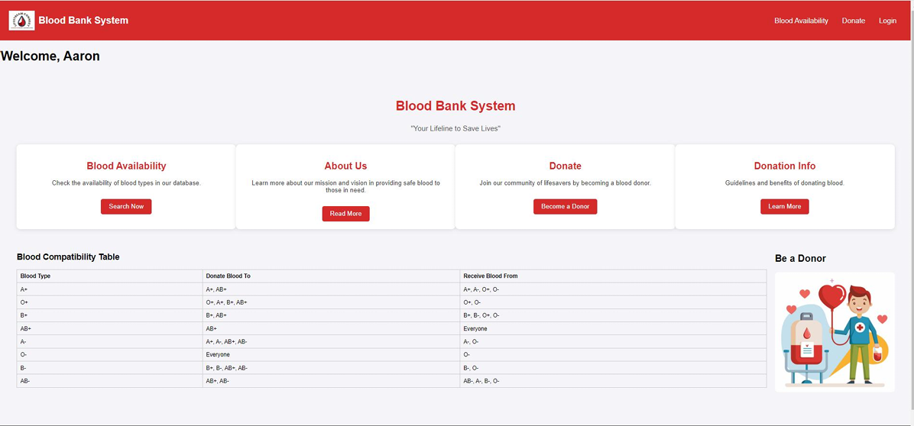

# Blood Donation Website 🩸
### Empowering Life Through Blood Donation

This is a Blood Donation Management System web application designed to streamline the process of blood donation and availability tracking. Users can register, login, check blood availability, and get important information about blood donation. The platform also provides guest access for easy information retrieval.

---

## Features

- User Registration & Login: Allows users to create accounts and securely log in.

- Blood Availability Checking: Users can check which blood groups are available.

- Guest Access: Guests can view important information and blood availability without registering.

- Information Pages: Detailed information about blood donation.

- Responsive UI: Modern and clean design with vibrant visuals for better user experience.

---

## Screenshots

### Home Page

### Text Analysis

### Analysis Result

### Analysis Result

### Analysis Result

### Analysis Result

### Analysis Result

### Analysis Result

### Analysis Result

---

## Tech Stack

**Frontend**
- HTML
- CSS
- JavaScript

**Backend**
- PHP

**Database**
- MySQL

---

## License

This project is open-source and free to use.
